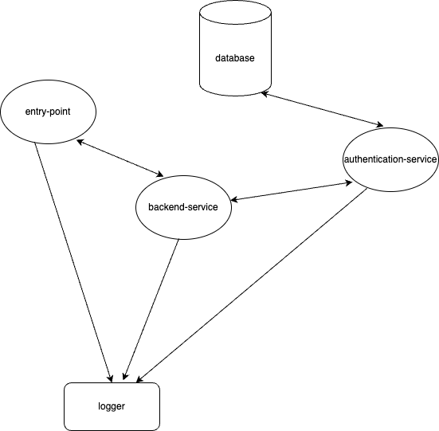

# microservice-app

This is an application that follows the microservice architecture. The complete application is broken into multiple microservices that have their own APIs.

Following diagram shows the basic architecture of the components of the application

## Some points regarding diagram

- The double arrow shows that the communication between the service is bidrectional while single arrow shows that the communication is unidirectional.

- Only the authentication service is the one responsible to communicate with the master database.

## Testing the application locally

- You will need to expose 4 ports on your system to expose the entry-point, backend-service, authentication-service and the logger service.

- The master database is what the user should provide to the application. If user does not have a master database and wants to start using the service, we provide the code in form of the database service.(However we believe user has their own infrastructure for the database.)

- We have a provision to add a caching application attached to the database if the user opt for. You can find the code for the cashing application [here](https://github.com/Aayush-Abhyarthi/caching-application). (This service is still under development, however some of the basic functionalities can still be used)

- `docker build . -t myserver:latest` 
- `docker run -it -p 8000:8000 myserver:latest` 

